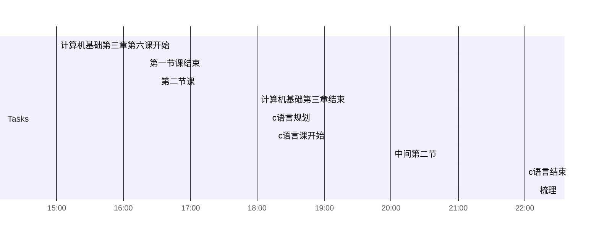

## Day Planner

- [x] 15:00 计算机基础第三章第六课开始
- [x] 16:20 第一节课结束
- [x] 16:30 第二节课
- [x] 18:00 计算机基础第三章结束
- [x] 18:10 c语言规划
- [x] 18:15 c语言课开始
- [x] 20:00 中间第二节
- [x] 22:00 c语言结束
- [x] 22:10 梳理
- [ ] 22:30梳理结束