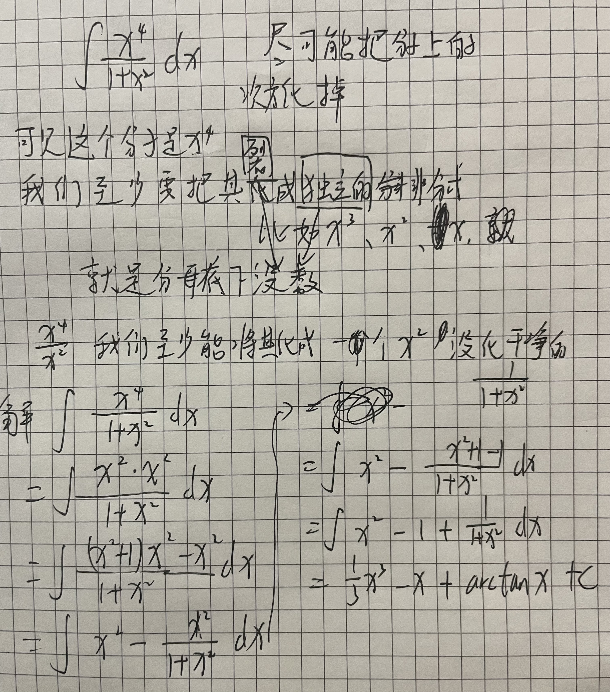
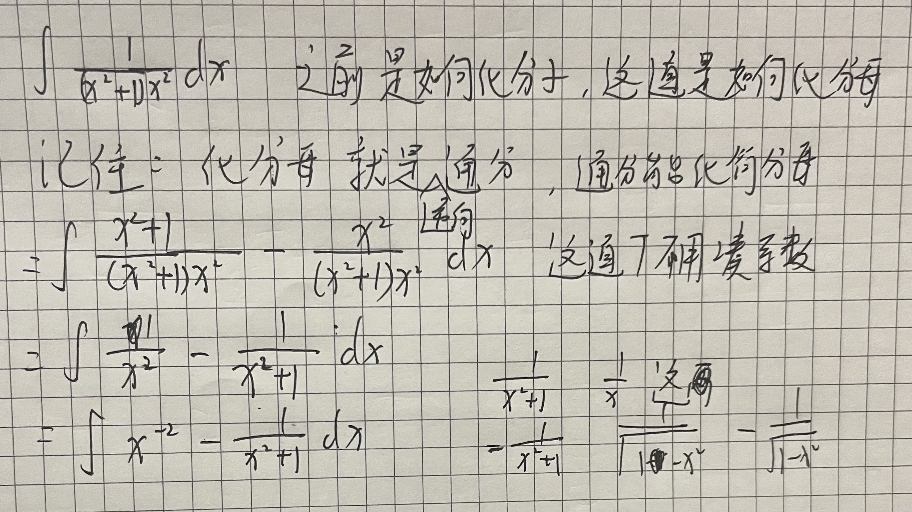

### dy/dx是什么含义?  
就是对y这个表达式求导  
  
dx就是无穷小量  
  
  
  
例:  
  
  
##### d口 = 口'dx  
  
  
### 积分存在的意义是什么?  
积分是对求导/微分的逆运算  
### 牛顿莱布尼茨定律  
  
我们可以通过对一个函数积分来获取该函数的原函数  
对这个原函数进行作差  
就能得到某一区间内的面积了  
简而言之  
就是将求面积变为求长度  
通过积分来更精确的求出面积  
  
##### 相关性质  
如下:  
  
  
为什么积分后算原函数的差来算面积更精确呢?  
因为一开始是用无数多个矩形或者梯形来近似模拟曲线所围绕的面积  
传统的直线所围成的面积由于其斜率变化少,可以直接算面积  
但到了曲线之后  
算面积就非常难了  
为什么?  
因为f(x)的斜率一直在变化  
每一个dx对应的dy/dx(斜率)一直在变  
矩形模拟面积来算误差比较大  
所以用牛顿莱布尼茨定律算更精准  
  
##### 定律证明  
求一个导函数的面积  
就是a到b点所有f'(x)×dx的和    
dx为无穷个小段  
则f'(x)×dx是每个小段的面积  
那这个和就是整个导函数围成的面积  
  
这个式子可以化简  
f'(x)×dx = dy/dx × dx = dy  
那就相当于  
从a点到b点所有dy的和就是导函数面积  
注意dy就是△y,是两个无穷小的y的差  
所以从a点到b点所有dy的和就是f(b)-f(a)=导函数面积  
因此证明出  
  
### 积分公式  
a^x导数 = $a^{x} lna$  
arctanx导数 = $1 \over 1+x^{2}$  
arctanx和arccotx互为相反数  
arccotx导数= -$1 \over 1+x^{2}$  
arcsinx导数 = $1 \over  \sqrt{1-x^{2}}$   
arcsin和arccos互为相反数  
arccos导数 = -$1  \over    \sqrt {1-x^{2}}$  
lnx导数=$1 \over x$在积分里lnx要加绝对值为|lnx|+c  
  
幂函数积分,其指数加1,然后系数分母乘指数  
  
上面这些都是可以一眼看出来的,且并不会灵活的让你去算  
所以记住了好替换  
不能在化简完之后不知道怎么替换,死在求积分的最后一步  
  
  
三角函数的积分  
  
##### 记忆技巧  
像arc这样的反三角直接硬记  
复合的比如secxtanx组合在一起的通过推一边也可以推出来,没必要记  
a^x的那个经常考,必须记住  
1/x求积分只要涉及到自变量在分母就可能有lnx,且这个要加绝对值  
  
  
### 分式求积分  
##### 分式分子次数高求积分  
  
##### 分式分母次数高求积分  
  
  
  
### 三角函数求积分  
消除"1"  
因为1在三角函数里不能直接积分  
  
  
### 凑微分  
凑微分是基于两个规则基础  
* 内部函数的一部分可以通过求积分的方式摘出去,摘到dx上,形式是其求积分的结果  
* 对一个函数的积分不影响这个自变量内部的表达式  
规则1可以化简原式,将一部分划到dx那边  
凑成∫f(u)du  
规则2可以解释对于f(u)的积分不会影响到u内部x的结果  
因此在算完后可以将x带入到u中  
  
凑微分主要围绕着原式中哪一部分可以积分移到dx那边  
* 比较简单的题中  
一部分积分可以直接得到另一部分的完全一样的形式,这种不需要拐弯,一眼就能看出要化哪个部分  
  
* 中等难度的题中  
a部分求积分可能只是b部分表达式的一部分  
这种在凑完后还有再求u的积分再带入,其实也不难  
* 高等难度的题中  
a部分和b部分乍一看,相互求积分都和对面式子没关系  
这时候就要思考如何拆整个表达式,拆出正确形式的a部分和b部分  
以及对a部分/b部分进行转换,使a/b部分有积分后相关的联系  
  
  
  
### 直接积分化一次系数  
可以直接在dx里的x加系数  
但是前面表达式需要系数修正  
下面又忘记加c了!!!  
  
  
常数可以直接在dx上加减,不需要后面在表达式上额外去修正  
  
  
### 分部积分  
什么时候用分部积分?  
凑积分用不了就用分部积分  
就是表达式拆开了后两个式子之间没有导数关系  
  
  
分部积分公式  
∫udv = uv - ∫vu'dx   ,进屋给男朋友一巴掌  
怎么找u?  
反对幂指三  
谁在前面谁是u  
后面的v就要求积分凑到dx里  
这样才能用分部积分  
  
### 定积分概念  
一个函数在a到b的面积就是  
这个函数从a到b的积分  
就是这个函数的原函数在a和b的结果作差  
  
  
##### 定积分计算  
  
  
分部积分算定积分  
  
